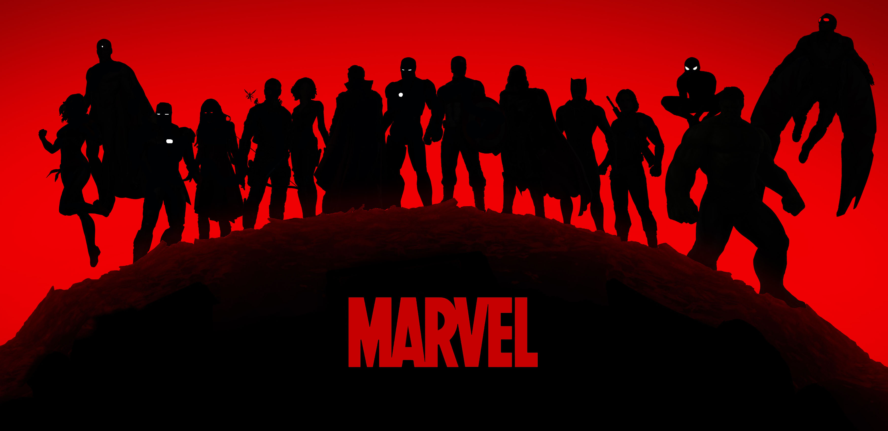
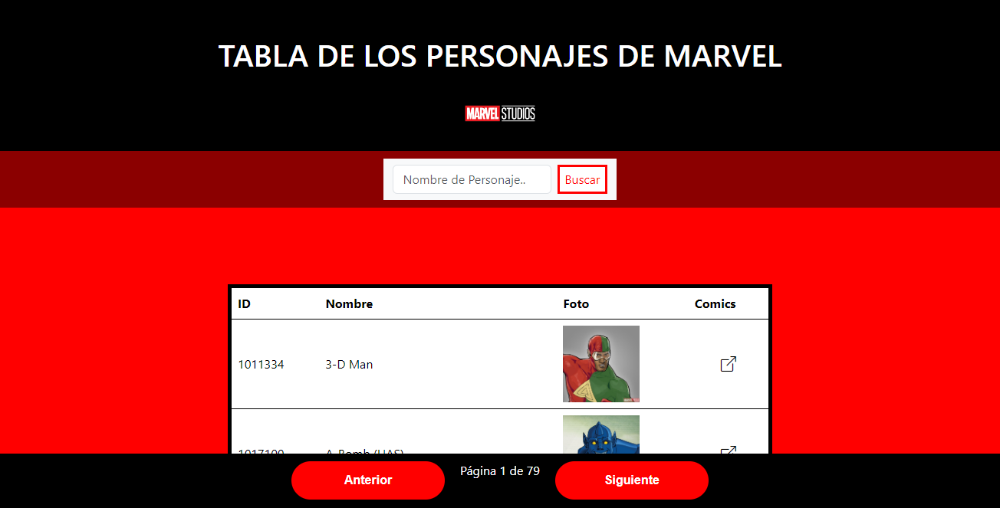

# Tabla de Marvel

## Descripción
#### Proyecto que utiliza una API para obtener datos de personajes y cómics del universo Marvel, presentándolos en una tabla dinámica implementada en HTML. Descubre información detallada de tus héroes favoritos en un formato accesible y fácil de explorar.
## Visuales
### El proyecto contiene:
- Barra de busqueda
- Paginación
- Tabla con los personajes de marvel
  

## Construido Con 🛠️
- HTML
- JAVASCRIPT
- CSS
## Autores ✒️
- Axel Perez [🔍](https://github.com/axelprz)
- Leonardo Pelaytay [🔍](https://github.com/LeoTheGoldenBoy)
- Juan Murua [🔍](https://github.com/juanmm77)
- Agustín Clavijo [🔍](https://github.com/AguusClavijo)
